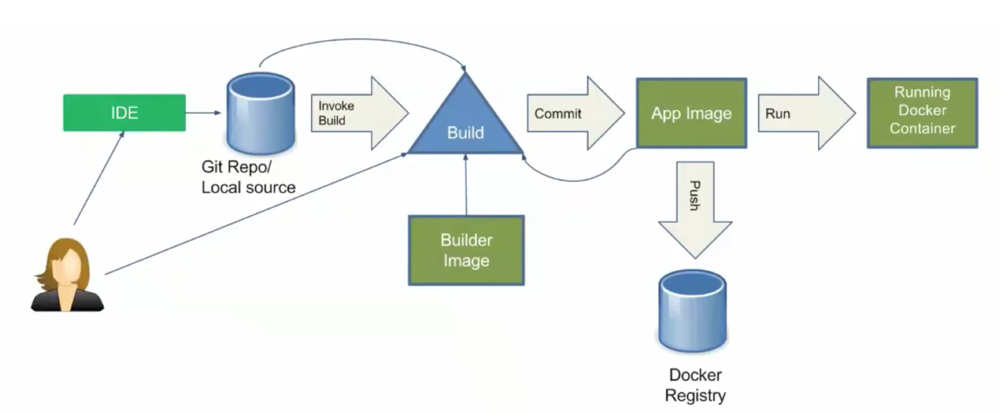

# "Source code" for a simple "langage" called the simple-cat-runtime.

This directory contains the 'source code' which can be built using the related [s2i-simple-builder](../builder).

## Diagram of the s2i process



The simple-cat-runtime will output the contents of any files inside a "src/" directory.   That's all!! 

## Try this out

To try this out use this pre existing src/ directory which contains the 'source code' files, hellofile and worldfile.  Make sure you change directory into "myapp" or you have a sub-directory named "src" which holds some text files.

```
find src
```

The output of this command should be the same as or similar to:

```
src
src/hellofile
src/worldfile
```

To build your very simple application, use one of the following ways.

## 1st way

Build using a build configuration that points to this github repository and then launch the resulting image 

```
oc new-build s2i-simple-builder~https://github.com/sjbylo/ocp-topics --context-dir=s2i-simple-builder/myapp --name myapp1

oc logs bc/myapp1 -f

Cloning "https://github.com/sjbylo/ocp-topics" ...
	Commit:	b0d508b9e3655a6a6f148464e57e3c1d3412dbf4 (mod)
	Author:	Stephen <stephenbylo@gmail.com>
	Date:	Wed Jun 21 18:15:26 2017 +0800
+ echo '---> Preparing source...'
+ mkdir -p /tmp/myapp
+ cp -Rf /tmp/src/src/. /tmp/myapp
---> Preparing source...
Pushing image 172.30.1.1:5000/myproject/myapp1:latest ...
Pushed 0/6 layers, 3% complete
Pushed 1/6 layers, 17% complete
Push successful
```

Create an application from the newly created myapp1 image.

```
oc new-app myapp1
oc get pod
```

Show the "simple application" is working by displaying its output. 

```
oc logs <myapp1-pod>
```


## 2nd way

Build using a binary build configuration and then launch the resulting image 

```
oc new-build s2i-simple-builder --name myapp2 --binary=true
```

Start the s2i build process which will run the s2i builder image, upload the current directory (--from-dir=.) into it and execute the assemble script. 

```
oc start-build myapp2 --from-dir=.       
oc logs bc/myapp2 -f
```

Create an application from the newly created myapp image.

```
oc new-app myapp2
oc get pod
```

Show the "simple application" is working by displaying its output. 

```
oc logs <pod>
```

## 3rd way

Build and launch a new application with one command, using "oc new-app".

```
oc new-app s2i-simple-builder~https://github.com/sjbylo/ocp-topics --context-dir s2i-simple-builder/myapp --name myapp3
```
(Note that this command will clone the git repository and does not upload the 'current directory' to the s2i builder container, as in the above 2nd method.)


